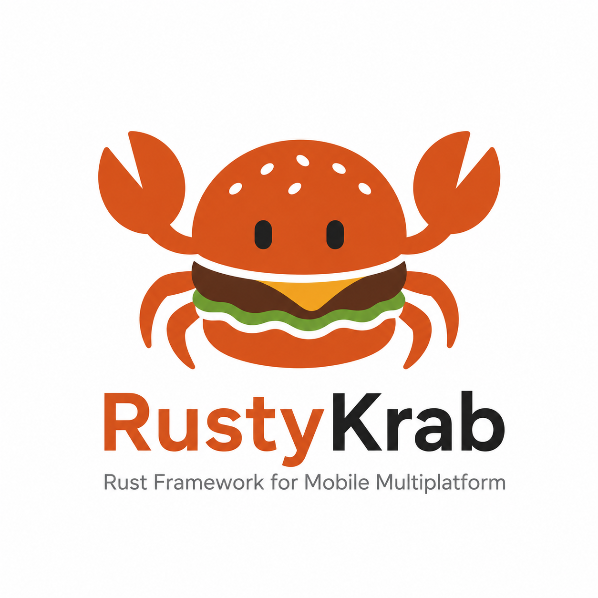

# RustyKrab

RustyKrab adalah framework cross-platform mobile development berbasis Rust yang memungkinkan developer membangun aplikasi native iOS dan Android menggunakan satu UI DSL berbasis Rust.
Tidak seperti Flutter, React Native, atau framework hybrid lainnya, RustyKrab tidak menggunakan rendering engine atau runtime UI sendiri.
Sebaliknya, RustyKrab mengubah Rust UI DSL menjadi source code native platform:
SwiftUI untuk iOS
Jetpack Compose untuk Android
Pendekatan ini memungkinkan developer memperoleh manfaat single codebase sekaligus mempertahankan performa dan pengalaman native.